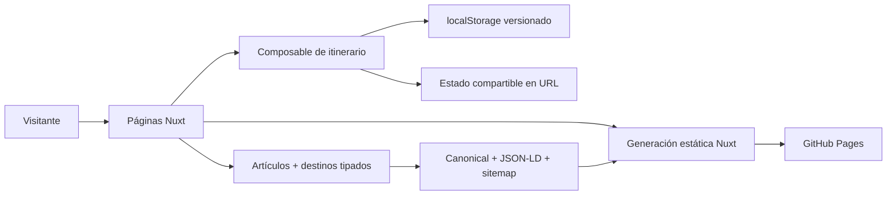

# Blog de Viajes

[English version](./README.md)

[](https://github.com/kevin0018/Blog-de-Viajes/actions/workflows/deploy.yml)

Una experiencia editorial para descubrir ciudades y convertir la inspiración
en un itinerario práctico, persistente y compartible.

[Ver demo](https://kevin0018.github.io/Blog-de-Viajes/) ·
[Explorar destinos](https://kevin0018.github.io/Blog-de-Viajes/post/destinos)

[](https://kevin0018.github.io/Blog-de-Viajes/)

## Funcionalidades destacadas

- Filtra seis destinos por duración, época, presupuesto y estilo de viaje.
- Abre una guía tipada con contexto editorial y puntos de partida sugeridos.
- Construye un itinerario de 1, 3 o 5 días añadiendo, eliminando y reordenando
  paradas.
- Recupera el viaje desde almacenamiento local versionado o comparte su estado
  exacto mediante la URL, sin cuentas ni backend.
- Lee artículos completos mediante rutas dinámicas generadas estáticamente.
- Recorre una interfaz personalizada y responsive con foco visible, reducción
  de movimiento, navegación sticky y estados vacíos diseñados.

El proyecto trata un blog de viajes pequeño como un producto, no como una
colección de páginas estáticas. El contenido, las rutas, los metadatos, el
sitemap y las funciones interactivas parten de fuentes tipadas compartidas.

## Arquitectura



La aplicación desplegada es completamente estática. El navegador conserva el
itinerario y los parámetros de consulta permiten reproducir la duración y el
orden de paradas en otro dispositivo. Ningún dato personal se envía a un
servidor de la aplicación.

### Decisiones que merece la pena revisar

- Las mismas fuentes tipadas alimentan listados, detalles, filtros, metadatos y
  sitemap sin duplicar contenido.
- Al abrir un itinerario compartido, la URL tiene prioridad sobre la
  persistencia local; las ediciones posteriores sincronizan ambos estados.
- Las utilidades puras del itinerario están separadas del ciclo de vida de Vue
  y de las APIs del navegador.
- El pipeline de imágenes genera AVIF responsive con fallback WebP y conserva
  imágenes sociales compatibles con crawlers.
- El scroll del router es explícito para impedir que un hook tardío de Nuxt
  sobrescriba el desplazamiento manual del visitante.
- El movimiento CSS se concentra en la ruta del home y se desactiva mediante
  `prefers-reduced-motion`.

## Tecnologías

- **Aplicación:** Nuxt 3, Vue 3 y TypeScript
- **Interfaz:** Tailwind CSS 4, design tokens, Nuxt Icon y Nuxt Fonts
- **Contenido:** módulos tipados de artículos y destinos con rutas dinámicas
- **Estado:** composables de Vue, parámetros de URL y almacenamiento versionado
- **Multimedia:** Sharp, AVIF responsive y fallback WebP
- **Testing:** Vitest, Vue Test Utils, happy-dom y Playwright
- **Entrega:** pnpm, GitHub Actions, generación estática y GitHub Pages

## Estructura del proyecto

```text
Blog-de-Viajes/
├── app/                       # Comportamiento del router
├── components/                # Header, footer, multimedia y planificador
├── composables/               # Itinerario, canonical y JSON-LD
├── data/                      # Artículos y destinos tipados
├── pages/                     # Rutas estáticas y dinámicas de Nuxt
├── scripts/                   # Optimización reproducible de imágenes
├── server/routes/             # Sitemap generado desde el contenido
├── tests/                     # Tests unitarios, de componente y navegador
├── types/                     # Contratos de contenido e itinerario
└── utils/                     # Utilidades puras del itinerario y del sitio
```

## Desarrollo local

Requisitos:

- Node.js 22 o superior
- pnpm 11

Instala las dependencias y arranca Nuxt:

```bash
pnpm install
pnpm dev
```

El proyecto utiliza la misma ruta base que GitHub Pages:

```text
http://localhost:3000/Blog-de-Viajes/
```

## Comandos

```bash
pnpm lint             # ESLint
pnpm typecheck        # Comprobación de tipos de Nuxt y Vue
pnpm test             # Seis tests unitarios y de componente
pnpm test:e2e         # Cinco comprobaciones E2E en Chromium
pnpm images:optimize  # Regenera AVIF y WebP desde los JPG fuente
pnpm generate         # Genera el sitio estático completo
```

## Despliegue en GitHub Pages

Cada push a `main` ejecuta lint, tipos, Vitest, Playwright y generación estática
antes de que GitHub Actions publique `.output/public`. El workflow también se
puede iniciar manualmente.

Se conserva un despliegue de compatibilidad mediante la rama `gh-pages`:

```bash
pnpm generate
pnpm deploy
```

## Contenido y créditos fotográficos

Las guías son puntos de partida editoriales, no información en tiempo real sobre
visados, seguridad, precios o accesibilidad. Las fotografías proceden de
Unsplash y mantienen la atribución de sus autores en la interfaz.
