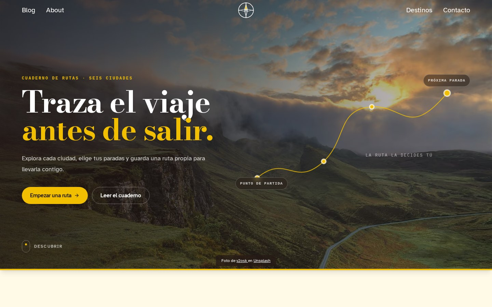
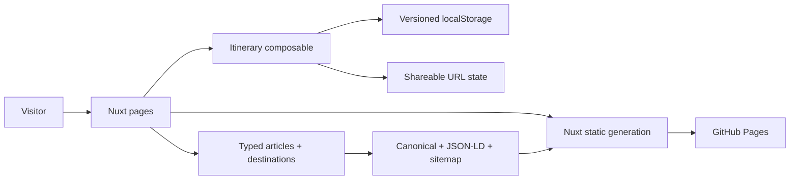

# Blog de Viajes

[Versión en español](./README.es.md)

[](https://github.com/kevin0018/Blog-de-Viajes/actions/workflows/deploy.yml)

An editorial travel experience for discovering cities and turning inspiration
into a practical, persistent, and shareable itinerary.

[Live demo](https://kevin0018.github.io/Blog-de-Viajes/) ·
[Destination explorer](https://kevin0018.github.io/Blog-de-Viajes/destinations)

[](https://kevin0018.github.io/Blog-de-Viajes/)

## Highlights

- Filter six destinations by trip length, season, budget, and travel style.
- Open a typed city guide with editorial context and suggested starting points.
- Build a 1, 3, or 5-day itinerary by adding, removing, and reordering stops.
- Restore a trip from versioned local storage or share its exact state through
  the URL—without requiring an account or backend.
- Read complete travel articles through statically generated dynamic routes.
- Navigate a responsive custom interface with visible focus, reduced-motion
  support, sticky navigation, and purpose-built empty states.

The project treats a small travel blog as a product rather than a collection of
static pages. Content, route generation, metadata, sitemap entries, and
interactive features all derive from shared typed sources.

## Architecture



The deployed application is fully static. The browser owns itinerary state,
while query parameters make a selected duration and stop order reproducible on
another device. No personal data is sent to an application server.

### Decisions worth reviewing

- Shared typed sources drive listings, detail pages, filters, metadata, and the
  generated sitemap without duplicating content.
- URL state takes precedence over local persistence when a shared itinerary is
  opened; later edits synchronize both representations.
- Pure itinerary utilities are kept separate from Vue lifecycle and browser
  storage concerns.
- The image pipeline generates responsive AVIF assets with WebP fallbacks while
  preserving crawler-friendly social images.
- Router scroll behavior is explicit, preventing a late Nuxt loading hook from
  overriding a visitor's manual scroll.
- CSS motion is concentrated in the home travel route and disabled through
  `prefers-reduced-motion`.

## Stack

- **Application:** Nuxt 3, Vue 3, and TypeScript
- **Interface:** Tailwind CSS 4, custom design tokens, Nuxt Icon, and Nuxt Fonts
- **Content:** typed article and destination modules with dynamic routes
- **State:** Vue composables, URL query parameters, and versioned local storage
- **Media:** Sharp, responsive AVIF, and WebP fallbacks
- **Testing:** Vitest, Vue Test Utils, happy-dom, and Playwright
- **Delivery:** pnpm, GitHub Actions, static generation, and GitHub Pages

## Project structure

```text
Blog-de-Viajes/
├── app/                       # Router behavior
├── components/                # Header, footer, media, and trip planner
├── composables/               # Itinerary, canonical, and JSON-LD behavior
├── data/                      # Typed articles and destinations
├── pages/                     # Static and dynamic Nuxt routes
├── scripts/                   # Reproducible image optimization
├── server/routes/             # Sitemap generated from shared content
├── tests/                     # Unit, component, and browser tests
├── types/                     # Public content and itinerary contracts
└── utils/                     # Pure itinerary and site utilities
```

## Local development

Requirements:

- Node.js 22 or newer
- pnpm 11

Install dependencies and start Nuxt:

```bash
pnpm install
pnpm dev
```

The project uses the same base path as GitHub Pages:

```text
http://localhost:3000/Blog-de-Viajes/
```

## Commands

```bash
pnpm lint             # ESLint
pnpm typecheck        # Nuxt and Vue type checking
pnpm test             # Six unit and component tests
pnpm test:e2e         # Ten Chromium end-to-end checks
pnpm images:optimize  # Regenerate AVIF and WebP assets from source JPGs
pnpm generate         # Generate the complete static site
```

## GitHub Pages deployment

Every push to `main` runs linting, type checking, Vitest, Playwright, and static
generation before GitHub Actions publishes `.output/public`. The workflow can
also be started manually.

A compatibility deployment through the `gh-pages` branch remains available:

```bash
pnpm generate
pnpm deploy
```

## Content and photo credits

The guides are editorial starting points, not live advice about visas, safety,
prices, or accessibility. Travel photography comes from Unsplash and retains
author attribution in the interface.
